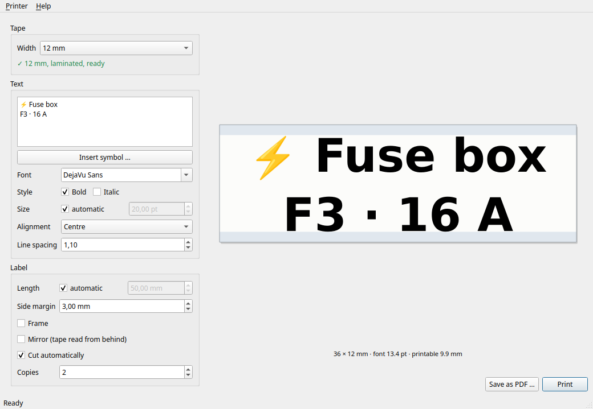

<div align="center">


# P-touch Studio

**Labels for Brother P-touch tape cassettes — on Linux, over Bluetooth, without the vendor software.**

[](https://github.com/tombueng/ptouch-studio/actions/workflows/ci.yml)
[](LICENSE)

</div>



Brother ships no Linux application, and the tools that do exist treat the printer
as a destination only: they have no idea which tape is loaded. P-touch Studio asks
the device directly — before every print.

## What it does

- **Detects the tape instead of guessing.** The inserted cassette is read over
  Bluetooth, in the background and once more right before printing. If the layout
  does not match the loaded tape, you hear about it before material is spent.
- **A preview that tells the truth.** The print head cannot reach the edges of the
  tape — on 12 mm tape only 9.9 mm are printable. The preview shows that strip, and
  preview and print go through the same renderer.
- **Automatic font size** that really fills the printable height, measured from the
  glyphs rather than from the font metrics.
- Any installed font, alignment, fixed or growing length, margins, line spacing,
  frame, mirroring for transparent tape, copies.
- **Symbols and emoji**, inserted from a palette. Outline symbols (★ ⚠ ✓ → Ω €)
  print as crisp vectors; pictographs such as 🔧 📦 come from a colour bitmap font
  that no PDF can embed, so those labels are rendered as a greyscale image instead
  — which is exactly what the preview then shows.
- **Guided setup**: find the device, pair it, create the Bluetooth port and the
  print queue — from inside the application.
- **Command line** for batches and scripts.

## Installation

### Debian, Ubuntu, Linux Mint

```bash
sudo apt install ./ptouch-studio_0.2.0_amd64.deb
```

### Fedora, openSUSE

```bash
sudo dnf install ./ptouch-studio-0.2.0-1.x86_64.rpm
```

### Arch Linux

```bash
cd packaging/arch && makepkg -si
```

### Everything else (AppImage)

```bash
chmod +x P-touch_Studio-x86_64.AppImage
./P-touch_Studio-x86_64.AppImage
```

The AppImage carries the application. The CUPS backend has to live in the system,
because CUPS starts it as a process of its own:

```bash
sudo install -m 700 ptouch-cups-backend-x86_64 /usr/lib/cups/backend/rfcomm
```

Prebuilt packages are on the [releases page](https://github.com/tombueng/ptouch-studio/releases).

### Building from source

```bash
cmake -S . -B build -G Ninja -DCMAKE_BUILD_TYPE=Release -DCMAKE_INSTALL_PREFIX=/usr
cmake --build build
sudo cmake --install build
```

Needs Qt 6.2 or newer, a C++20 compiler and CMake ≥ 3.21. At runtime it wants
`bluez`, `cups` and the P-touch driver (`printer-driver-ptouch` on Debian and
Ubuntu, `ptouch-driver` on Fedora and Arch).

## Setup

The wizard opens by itself on first start. It finds the printer, pairs it and
creates the Bluetooth port and the print queue; the system part asks for the
administrator password once.

The same from a terminal:

```bash
ptouch-studio setup      # find, pair and configure
ptouch-studio check      # show what is still missing
```

The printer may stay connected to your phone throughout — that does not interfere
with pairing.

## Usage

```bash
ptouch-studio                              # graphical interface

ptouch-studio print "Workshop"             # tape width comes from the printer
ptouch-studio print "Line 1" "Line 2"      # several lines
ptouch-studio print -w 24 -a left "Shelf A"
ptouch-studio print -n 3 "Three times"
ptouch-studio print --pdf sample.pdf "Test"   # check without spending tape

ptouch-studio status                       # loaded tape, media, readiness
ptouch-studio status --json                # for scripts
```

`ptouch-studio print --help` lists every layout option.

## Supported devices

Developed and verified with the **PT-P710BT** (P-touch Cube Plus) over Bluetooth.

In principle every P-touch model works that
[ptouch-driver](https://github.com/philpem/printer-driver-ptouch) supports and that
offers a serial Bluetooth connection — PT-P300BT, PT-P700, PT-P750W, PT-E550W,
PT-P900W, PT-P950NW among them. Models whose print head differs from the PT-P700
series may have different printable heights; reports are welcome.

Tape widths: 3.5 / 6 / 9 / 12 / 18 / 24 mm.

## How it works

The path of a label:

```
layout (Qt) → PDF with an exact page size → CUPS → rastertoptch → RFCOMM backend → printer
```

Three parts of that are not obvious:

**The status query.** Asked with `ESC i S`, the printer answers with 32 status
bytes; byte 10 is the tape width in millimetres, and there is media type, error
state and print phase alongside. It costs no tape and takes milliseconds.

**The custom CUPS backend.** None of the backends shipped with CUPS cope with
RFCOMM: `serial` expects modem control lines an RFCOMM device does not carry, and
`file` opens non-blocking, which fails here. This backend opens blocking — that is
what brings the Bluetooth connection up in the first place — and waits for the
printer to report itself finished after the last byte. Without that wait, multiple
copies lose their last label, because the connection drops while the device is
still working.

**Colour emoji.** Qt happily draws them on screen, but a PDF cannot carry colour
bitmap glyphs — they disappear on the way to the printer without any error. Which
characters are affected cannot be decided by code point (⚡ U+26A1 comes from the
colour font, ★ U+2605 does not), so the fonts are asked directly: if no outline
family can draw a character, the whole label goes out as an image.

**Font scaling.** Qt converts point sizes against the device resolution. Scaling
the coordinate system on top of that for a 600 dpi PDF makes text come out 600/72
too large while every other measurement stays correct. Fonts are therefore defined
in device-independent pixel sizes. The [tests](tests/EngineTests.cpp) rasterise the
produced PDF and measure the ink instead of trusting the arithmetic.

More in [docs/architecture.md](docs/architecture.md).

## Troubleshooting

| Symptom | Cause and cure |
|---|---|
| "printer does not answer" | The device powers itself off after a while. Switching it on is enough. |
| "no access to /dev/rfcomm0" | Setup incomplete — `ptouch-studio check` names the missing step. |
| "/dev/rfcomm0 is missing" | `systemctl status ptouch-rfcomm.service` |
| Job stays in the queue | The printer was unreachable. CUPS holds the job for 300 s and prints it once the device is back. |
| Queue stopped | `cupsenable PT-Label` |

More in [docs/troubleshooting.md](docs/troubleshooting.md).

## License

[MIT](LICENSE). Qt 6 is linked dynamically and stays under LGPL-3.0; the AppImage
bundles the Qt libraries in replaceable form.
